

  

<h1 align="center">رزمة — إدارة المطبعة</h1>

  برنامج عربي على ويندوز لإدارة المطبعة: فواتير وإيصالات، أسعار حسب المقاس واللون والورق، ديون الزبائن بالشيكل والدينار والدولار، مشتريات ومخزون، مصاريف، وتقارير أرباح.
   
  <b>يعمل بالكامل بدون إنترنت، وبيانات المحل تبقى على جهازك فقط.</b>

  <a href="https://github.com/AbuDergham/ruzma-releases/releases/latest"><b>⬇️ تنزيل آخر إصدار</b></a>

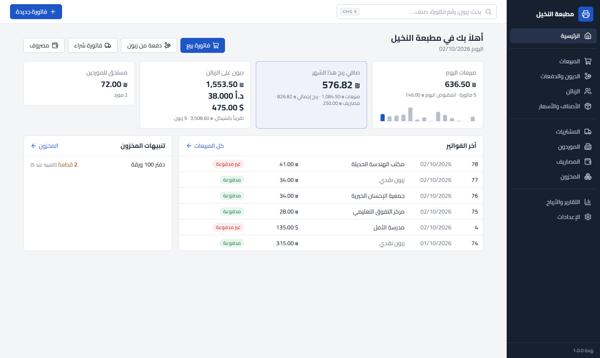

> الأسماء والأرقام في الصور بيانات تجريبية.

هذا المستودع لا يحتوي على كود. فيه ملفات تنصيب البرنامج فقط، ومنه يقرأ البرنامج التحديثات تلقائياً.

---

## المحتويات

- [التنصيب](#التنصيب)
- [أول ما تفتح البرنامج](#أول-ما-تفتح-البرنامج)
- [ماذا يفعل البرنامج](#ماذا-يفعل-البرنامج)
- [النسخ الاحتياطي: حافظ على بياناتك](#النسخ-الاحتياطي-حافظ-على-بياناتك)
- [التحديثات](#التحديثات)
- [الرقم السري](#الرقم-السري)
- [أين تُحفظ البيانات والانتقال لجهاز جديد](#أين-تُحفظ-البيانات-والانتقال-لجهاز-جديد)
- [اختصارات لوحة المفاتيح](#اختصارات-لوحة-المفاتيح)
- [أسئلة شائعة](#أسئلة-شائعة)
- [الإصدارات](#الإصدارات)

---

## التنصيب

**المتطلبات:** ويندوز 10 أو 11 (64 بت). لا يحتاج إنترنت إلا لتنزيل التحديثات.

1. افتح صفحة [آخر إصدار](https://github.com/AbuDergham/ruzma-releases/releases/latest)، ونزّل الملف `ruzma-setup-<الإصدار>.exe` من قسم **Assets**.
2. شغّل الملف. قد يظهر تحذير أزرق من ويندوز بعنوان «Windows protected your PC» أو «حمى Windows جهاز الكمبيوتر»:
   - اضغط **More info** (مزيد من المعلومات)
   - ثم **Run anyway** (تشغيل على أي حال)

   يظهر التحذير لأن الملف غير موقّع بشهادة مدفوعة، وهذا طبيعي.
3. أكمل خطوات التنصيب، وهي بالعربي:
   - اختر التنصيب **للمستخدم الحالي فقط** إذا لم تكن لديك صلاحيات مدير.
   - يمكنك تغيير مجلد التنصيب، أو تركه كما هو.
4. تجد اختصار **رزمة** على سطح المكتب وفي قائمة ابدأ.

---

## أول ما تفتح البرنامج

كل شيء يُضبط من **الإعدادات**:

| الخطوة | أين |
|---|---|
| اسم المحل، الهاتف، العنوان، الشعار (تظهر على الإيصالات)، ومقاس الإيصال: A5 أو حراري 80 ملم | الإعدادات ← بيانات المحل والفواتير |
| سعر صرف الدينار والدولار (تنبيه في الرئيسية حتى تحدّده) | الإعدادات ← العملات وأسعار الصرف |
| خيارات الأصناف، مثل المقاسات والألوان وأنواع الورق، والوحدات والتصنيفات | الإعدادات |
| الأصناف وأسعارها لكل تركيبة | الأصناف والأسعار ← صنف جديد |
| الزبائن، وأرصدتهم السابقة إن وجدت، وأسعارهم الخاصة | الزبائن |
| مجلد النسخ الاحتياطي، ويُفضّل أن يكون فلاشة أو مجلداً متزامناً مع السحابة | الإعدادات ← النسخ الاحتياطي |
| رقم سري، وهو اختياري | الإعدادات ← الرقم السري |

---

## ماذا يفعل البرنامج

### الفواتير والإيصالات
- **فاتورة بيع سريعة من لوحة المفاتيح:**
  1. اكتب اسم الصنف.
  2. اختر الخيارات، مثل A4 وملون ووجهين.
  3. اكتب الكمية واضغط `Enter`.
- السعر يُعبّأ تلقائياً من الأسعار المحفوظة أو من سعر الزبون الخاص، ويمكن تعديله.
- خصم بمبلغ أو بنسبة. الفاتورة بالشيكل أو الدينار أو الدولار.
- الدفع يكون كاملاً أو جزئياً، أو يُسجَّل المبلغ كله ديناً، ويمكن الدفع بأكثر من عملة.
- طباعة إيصال **A5** أو **حراري 80 ملم**، أو حفظه PDF.

| فاتورة بيع | الإيصال الحراري |
|---|---|
| 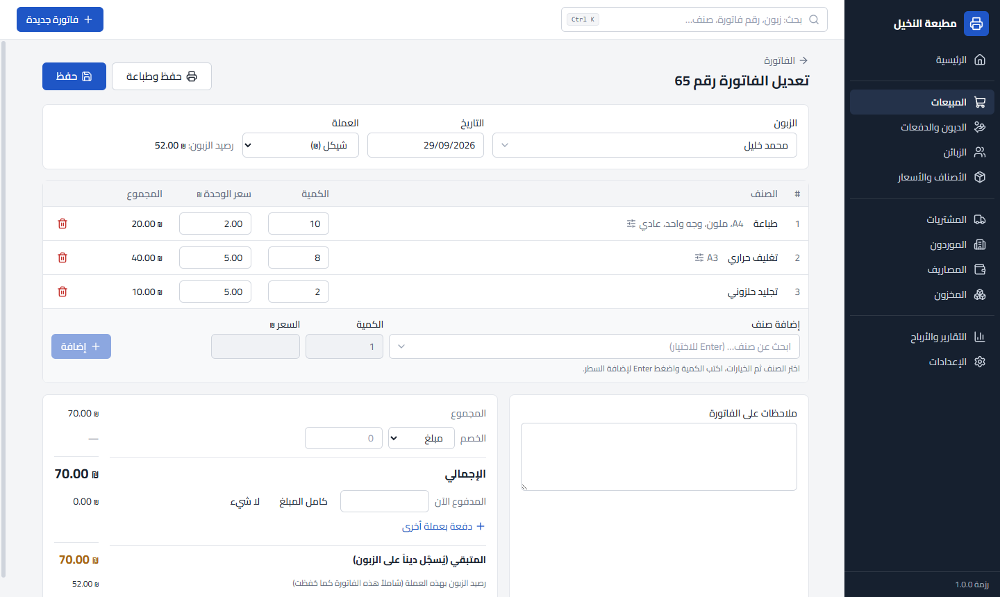 | 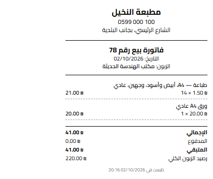 |

### الأسعار حسب الخيارات
- لكل صنف خياراته، ولكل تركيبة سعرها وتكلفتها. مثال: طباعة A4 أبيض وأسود وجه واحد على ورق عادي.
- التركيبة بدون سعر تعتبر غير متوفرة.
- **تعديل جماعي للأسعار:**
  - رفع أو خفض بنسبة.
  - سعر ثابت.
  - «A3 = A4 × 2».
- **نسخ الأسعار من صنف آخر.**
- **أسعار خاصة لكل زبون.**
- البرنامج يعرف أن الطباعة تستهلك ورقاً من المخزون، فينقصه ويحسب تكلفته في الربح.

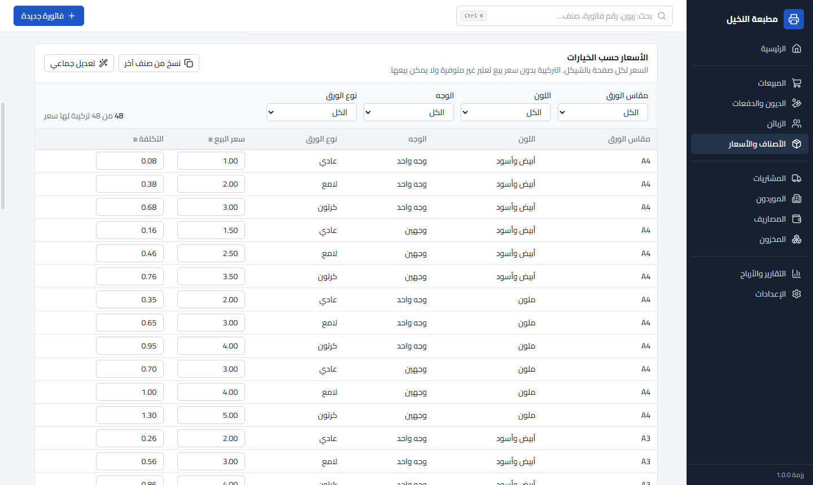

### الزبائن والديون بعدة عملات
- الرصيد لكل زبون بكل عملة على حدة. كل فاتورة ودفعة تحفظ سعر الصرف يوم تسجيلها.
- يمكن الدفع بعملة غير عملة الدين، مثل دنانير عن دين بالشيكل.
- كشف حساب يُطبع، أو يُحفظ PDF، أو يُصدَّر إلى Excel.

| الديون والدفعات | كشف حساب |
|---|---|
| 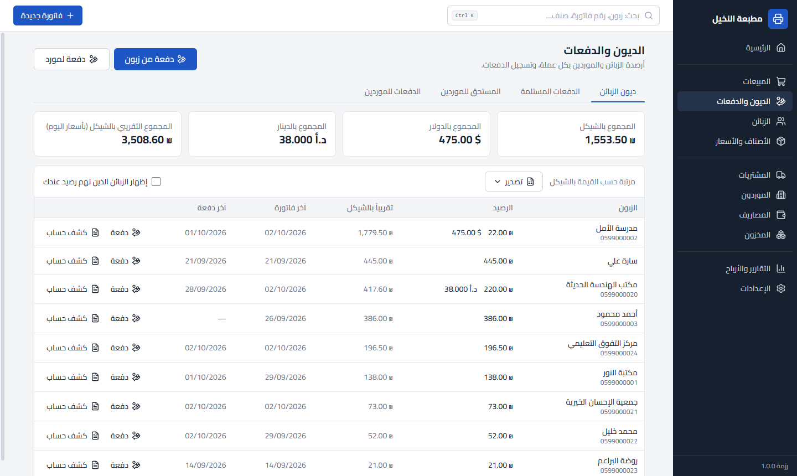 | 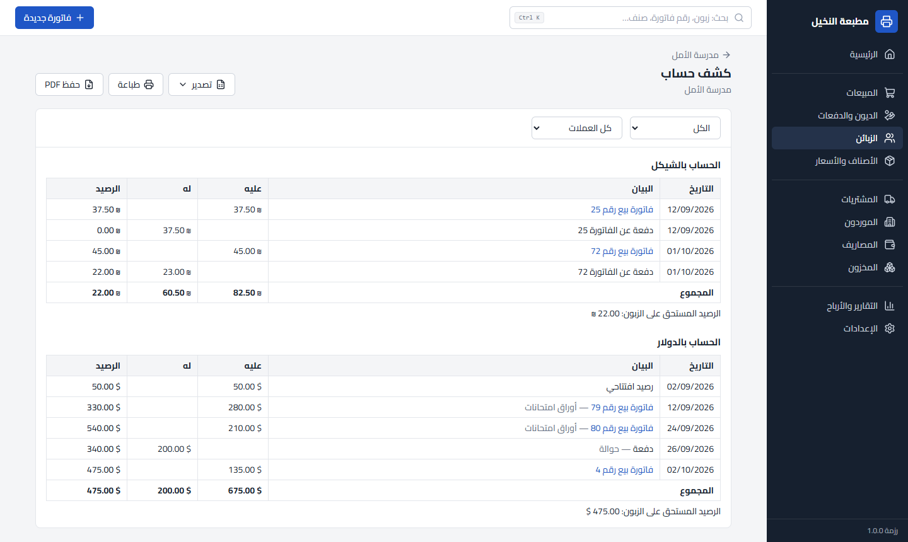 |

### المشتريات والمخزون والمصاريف
- فواتير شراء من الموردين، والمستحق لكل مورد.
- كميات المخزون، وتنبيه عند النقص، وجرد، وسجل حركات لكل صنف.
- **متوسط التكلفة** يُحسب تلقائياً من المشتريات.
- المصاريف حسب التصنيف: إيجار، كهرباء، صيانة…

| المخزون | المصاريف |
|---|---|
| 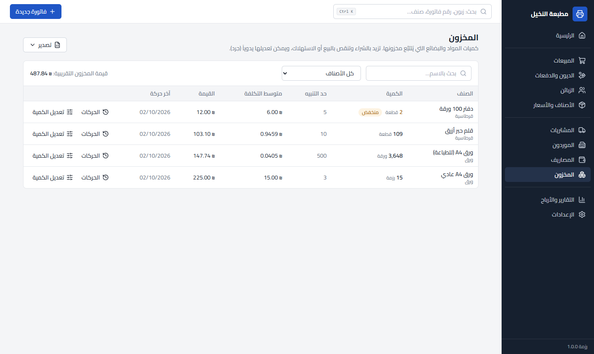 | 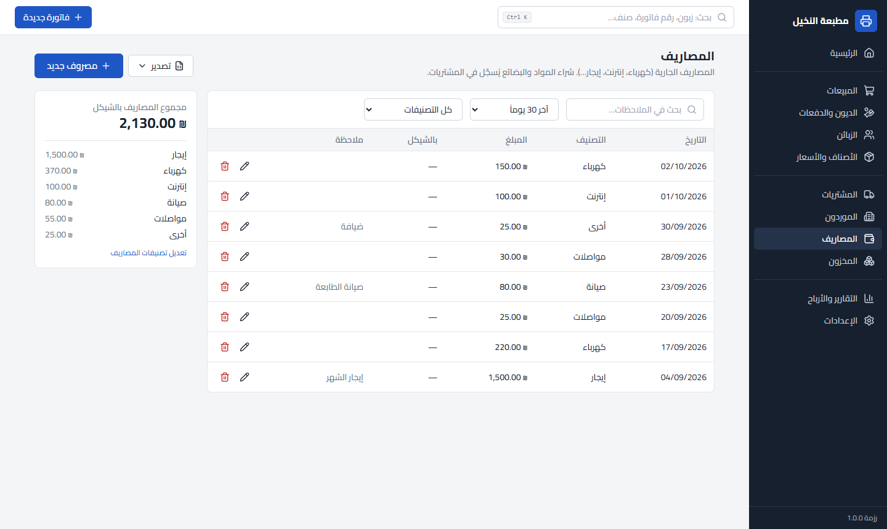 |

### التقارير والأرباح
- المبيعات، والتكلفة، والربح الإجمالي، والمصاريف، و**صافي الربح** بالشيكل لأي فترة.
- رسم بياني يومي.
- تفاصيل حسب الصنف وكل تركيبة خيارات، وحسب الزبون.
- المقبوض والمدفوع حسب العملة.

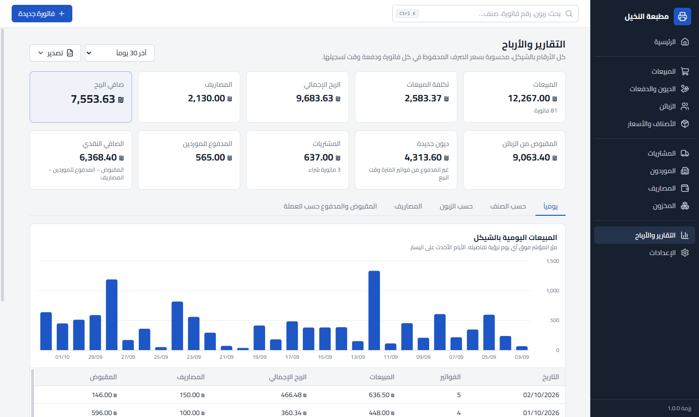

### التصدير إلى Excel
زر **تصدير** في كل القوائم والتقارير. الملف يفتح بالعربي من اليمين لليسار، بأرقام وتواريخ حقيقية قابلة للجمع والفرز.

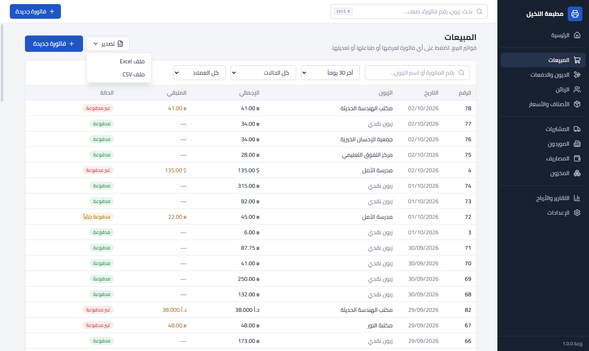

---

## النسخ الاحتياطي: حافظ على بياناتك

- **نسخة تلقائية كل يوم** عند أول فتح للبرنامج.
- **عند الإغلاق** يسألك البرنامج إذا تغيّرت البيانات منذ آخر نسخة. يمكنك ضبطه ليسأل، أو ينسخ دائماً، أو لا يسأل.
- **نسخة يدوية** من الإعدادات ← النسخ الاحتياطي ← «نسخة احتياطية الآن».
- المجلد الافتراضي: `المستندات\رزمة - نسخ احتياطية`.
- يحتفظ البرنامج بآخر 14 نسخة تلقائية، والنسخ اليدوية لا تُحذف أبداً.

> 💡 **انتبه:** النسخة على نفس الجهاز لا تحميك إذا تعطّل الجهاز. اختر مجلداً على فلاشة، أو مجلد OneDrive أو Google Drive، أو انسخ الملفات إلى مكان آخر بين فترة وأخرى.

| التذكير عند الإغلاق | إعدادات النسخ والاسترجاع |
|---|---|
| 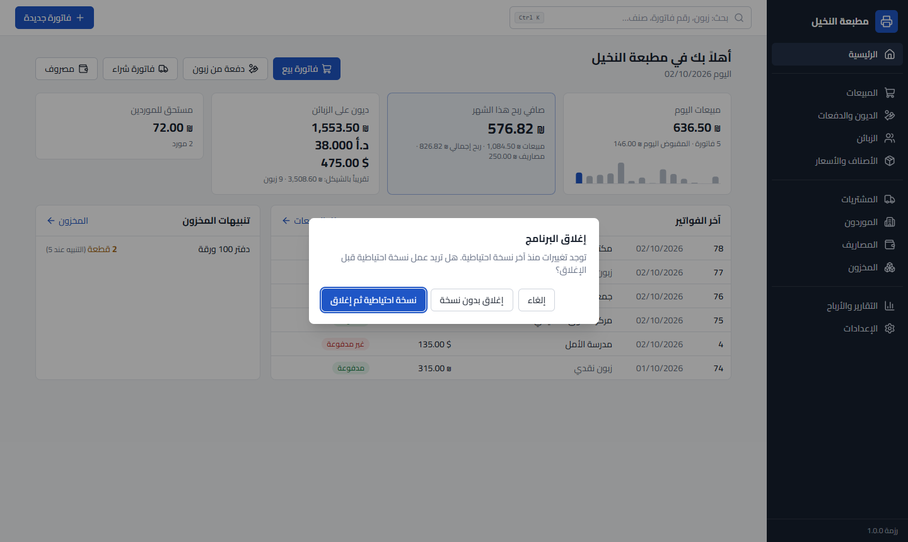 | 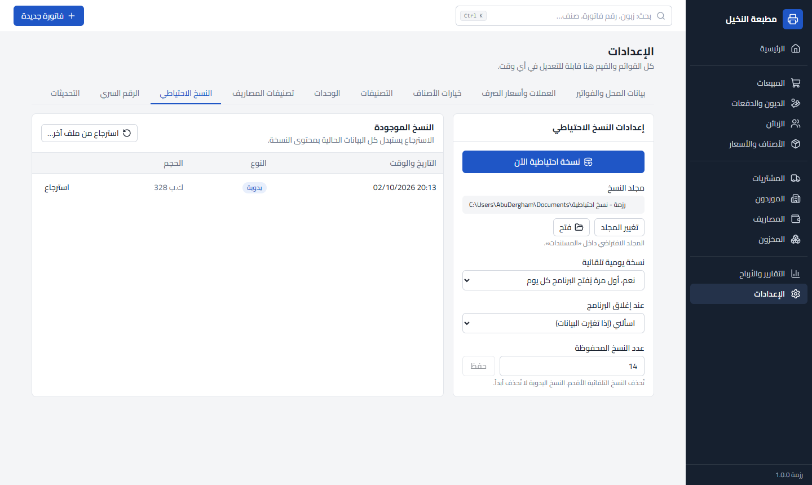 |

**الاسترجاع:**
1. اذهب إلى الإعدادات ← النسخ الاحتياطي.
2. اختر نسخة من القائمة، أو «استرجاع من ملف آخر…».
3. يعرض البرنامج عدد الفواتير في النسخة وتاريخ آخر فاتورة، لتتأكد قبل الاسترجاع.
4. يحفظ البرنامج نسخة من بياناتك الحالية، ثم يستبدلها بالنسخة المختارة، ثم يعيد التشغيل.

---

## التحديثات

- عند فتح البرنامج، وإذا كان الإنترنت متاحاً، يبحث عن إصدار جديد هنا وينزّله في الخلفية.
- عند الانتهاء يظهر شريط أخضر فيه **«تثبيت الآن وإعادة التشغيل»**. إذا تجاهلته، يُثبَّت التحديث تلقائياً عند إغلاق البرنامج.
- **التحديث لا يمس بياناتك**، ويحفظ البرنامج نسخة احتياطية قبله.
- يمكنك البحث يدوياً، أو إيقاف البحث التلقائي، من الإعدادات ← التحديثات.

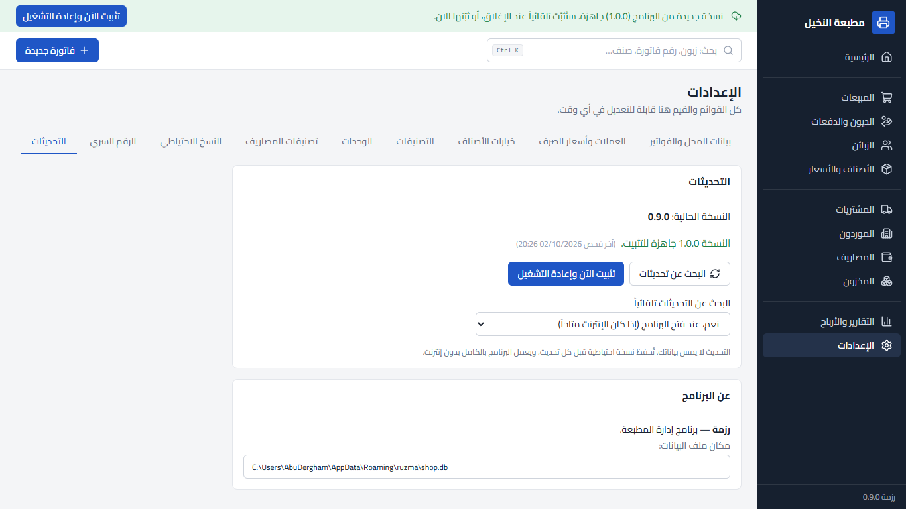

---

## الرقم السري

- اختياري، من 4 إلى 8 أرقام، ويُطلب عند فتح البرنامج.
- يمكن ضبط قفل تلقائي بعد مدة بدون استخدام، والقفل يدوياً من زر «قفل» أسفل القائمة.
- ⚠️ احفظ الرقم في مكان آمن. إذا نسيته لا يمكن فتح البرنامج إلا بمساعدة من أعدّه لك.

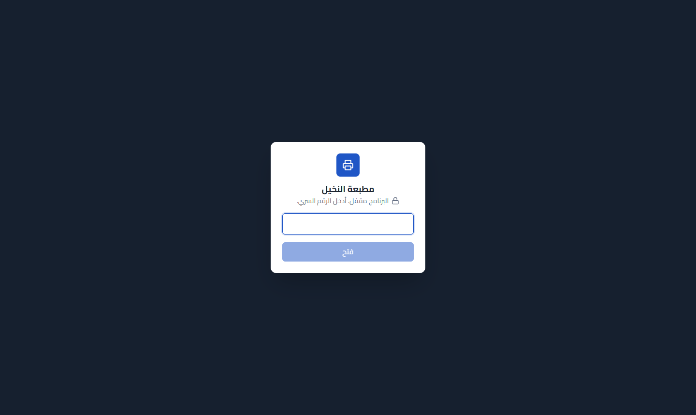

---

## أين تُحفظ البيانات والانتقال لجهاز جديد

- ملف البيانات: `%APPDATA%\ruzma\shop.db`. مكانه يظهر أيضاً في الإعدادات ← التحديثات ← عن البرنامج.
- **إلغاء تثبيت البرنامج لا يحذف البيانات.**
- لا يُرفع أي شيء من بيانات المحل إلى الإنترنت.

**للانتقال إلى جهاز جديد:**
1. على الجهاز القديم: «نسخة احتياطية الآن»، ثم انسخ الملف إلى فلاشة.
2. على الجهاز الجديد: نصّب البرنامج.
3. من الإعدادات ← النسخ الاحتياطي اختر «استرجاع من ملف آخر…» واختر الملف من الفلاشة.

---

## اختصارات لوحة المفاتيح

| الاختصار | ماذا يفعل |
|---|---|
| `Ctrl+K` | بحث عام: زبون، مورد، صنف، رقم فاتورة |
| `Enter` | في الفاتورة: إضافة السطر |
| `Ctrl+S` | حفظ الفاتورة |
| `Ctrl+P` | حفظ الفاتورة وطباعتها، ثم فتح فاتورة جديدة |

البحث يتجاهل الفروق بين أ/إ/آ/ا وة/ه وى/ي، ويقبل الأرقام الهندية.

---

## أسئلة شائعة

**هل يحتاج البرنامج إنترنت؟**
لا. كل شيء يعمل بدون إنترنت. الإنترنت يُستخدم فقط لتنزيل التحديثات.

**ظهرت رسالة «Windows protected your PC»، هل الملف آمن؟**
الرسالة تظهر لأي برنامج غير موقّع بشهادة تجارية. اضغط **More info** ثم **Run anyway**. نزّل البرنامج من هذه الصفحة فقط.

**هل يمكن استخدامه على أكثر من جهاز بنفس البيانات؟**
كل جهاز له بياناته الخاصة. لنقل البيانات استخدم النسخ الاحتياطي والاسترجاع.

**كيف أحذف البرنامج؟**
من إعدادات ويندوز ← التطبيقات ← رزمة ← إلغاء التثبيت. البيانات والنسخ الاحتياطية تبقى.

**الطابعة الحرارية لا تطبع بالمقاس الصحيح؟**
تأكد من اختيار «حراري 80 ملم» في الإعدادات ← بيانات المحل والفواتير، ومن مقاس الورق في إعدادات الطابعة نفسها.

---

## الإصدارات

كل الإصدارات وملاحظاتها في صفحة [Releases](https://github.com/AbuDergham/ruzma-releases/releases).

| الإصدار | التاريخ | الملاحظات |
|---|---|---|
| 1.0.0 | 02/10/2026 | الإصدار الأول |
